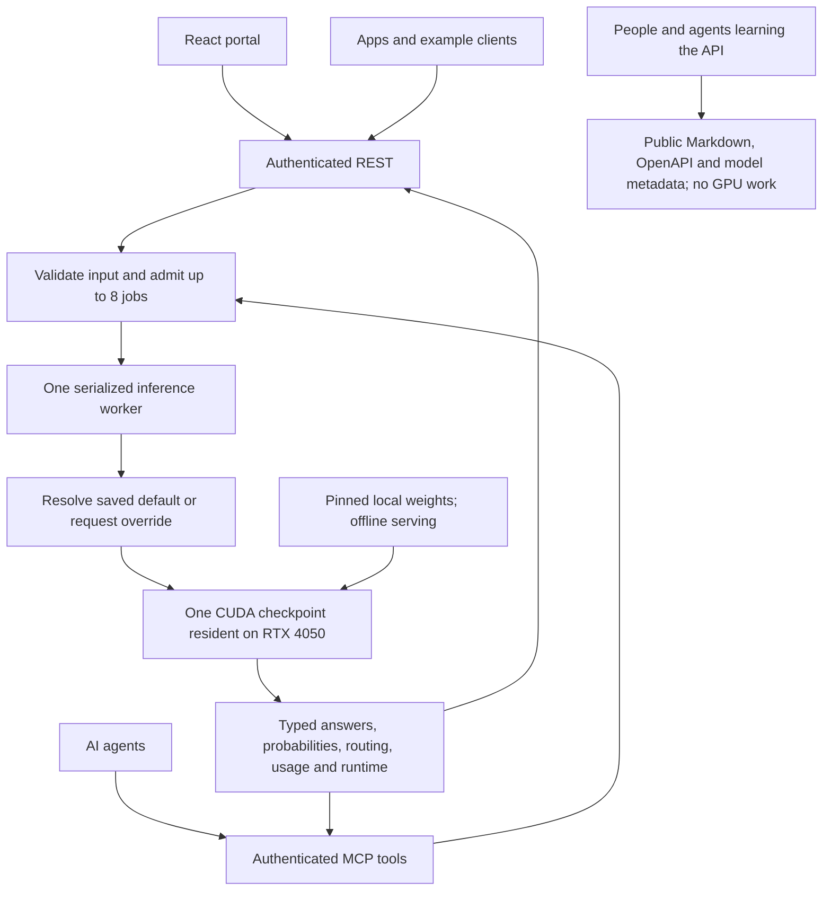

# How Laya Local works



The browser React dashboard, REST routes, and MCP tools all call one `InferenceService`. Only its single-worker executor can load checkpoints, run predictions, or change the default. Admission is bounded at eight outstanding jobs. A cancelled HTTP request keeps its slot until its actual work completes; this prevents clients from bypassing memory limits by disconnecting.

Laya's reference Router chooses English or multilingual for automatic requests. The service validates the selected checkpoint's budgets before loading. Named overrides do not change the saved default. The default is captured at admission and persisted atomically in `data/settings.json` only after a named checkpoint successfully loads.

The previous agent is removed from both the service and Router before the next agent is constructed. This avoids the reference Router's usual load-before-eviction allocation peak. One resident checkpoint owns the GPU; models are also grouped during batch inference to reduce reloads. Results are restored to their original request indices.

`GPUOnlyAgent` subclasses Laya 0.3.22. It uses the same tokenizer, encoder, decision heads, autocast policy, calibration logic and answer decoding. Its CUDA `_infer` body is the upstream run branch without CPU retry. CUDA is probed at startup, placement is checked after load, and OOM is surfaced as an error. CPU model construction/loading is permitted; CPU inference is not. The adapter refuses a different Laya version until reviewed.

The three checkpoints are downloaded from `convaiinnovations/laya` at revision `55cf4c4ebb4ebe31b2550e8bdf3bd21b99753851`. Only checkpoint weights, encoder configuration, and tokenizer artifacts are fetched. The service launches with `HF_HUB_OFFLINE=1` and `TRANSFORMERS_OFFLINE=1`. It never downloads a checkpoint during a prediction.

Native Windows Python 3.12 runs PyTorch 2.10.0+cu128. A project `.venv` and `uv.lock` isolate this service from global packages. Node builds the React/TypeScript frontend; the production process is Python only. Static UI, icons, licenses and Swagger assets are served locally by FastAPI.

Bearer authentication runs before request buffering for REST and MCP. The dashboard uses a key entered by the user and session storage for that tab. Test inputs/results stay in browser memory unless exported. Generic Markdown docs and the generated OpenAPI schema are public locally and contain no secrets. Cross-origin browser clients are disabled. A Windows firewall rule can permit the local subnet only. HTTP assumes a trusted LAN; public hosting/TLS is outside this deployment.

MCP SDK 2.2.0 is mounted at `/mcp/`. The top-level FastAPI lifespan starts the MCP session manager and drains/shuts down the inference worker. Localhost and discovered LAN addresses are allowlisted; custom hostnames require `LAYA_ALLOWED_HOSTS`. Tools never start another inference process.

Model loading time and inference time vary with checkpoint, input, disk cache and available VRAM. Status reports actual CUDA allocations and lifetime peak allocation. A first load can be much slower than later switches. Verification scripts save measured data in `data/verification` without credentials.

## A request that changes checkpoints

```mermaid
sequenceDiagram
    participant Client
    participant API as REST or MCP
    participant Worker as Shared GPU worker
    participant GPU as RTX 4050
    Client->>API: Predict with explicit model
    API->>API: Authenticate, validate and bound admission
    API->>Worker: Queue request with captured default
    Worker->>Worker: Resolve requested checkpoint
    alt Different from resident checkpoint
        Worker->>GPU: Unload old checkpoint and release allocations
        Worker->>GPU: Load pinned local checkpoint; verify CUDA placement
    end
    Worker->>GPU: Reference PyTorch forward pass
    alt CUDA succeeds
        GPU-->>Worker: Typed decisions and probabilities
        Worker-->>Client: Answers plus device, timing, usage and revision
    else CUDA fails
        GPU-->>Worker: GPU error
        Worker-->>Client: Documented failure; no CPU retry
    end
```

An explicit request does not save a new default. A named **default-setting** request instead loads/verifies the checkpoint before atomically persisting the setting. See [operations](operations.md) for commands and [the API contract](api.md) for admission limits and errors.
