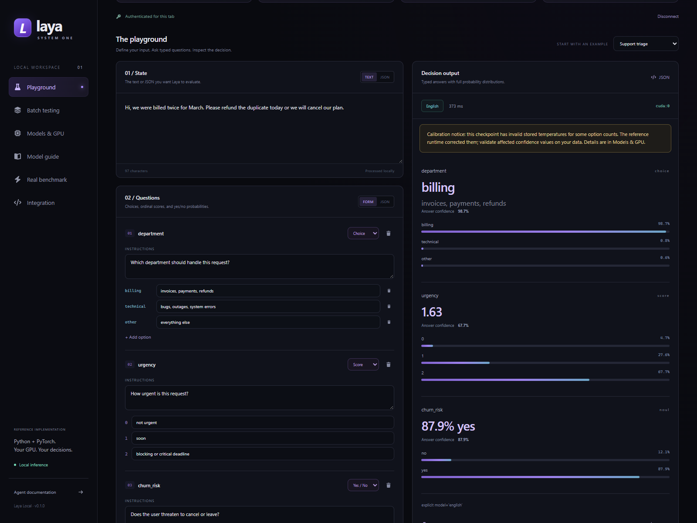
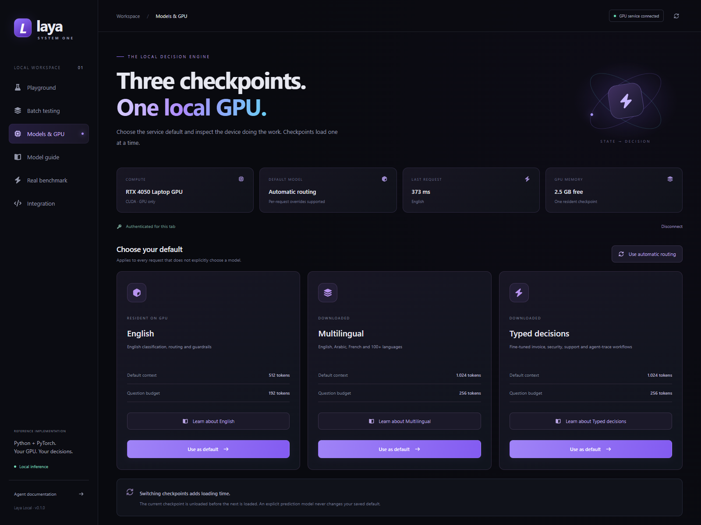
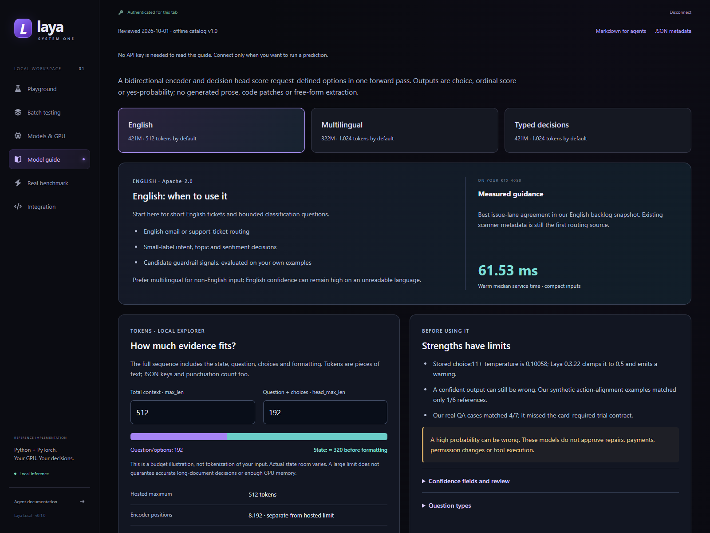
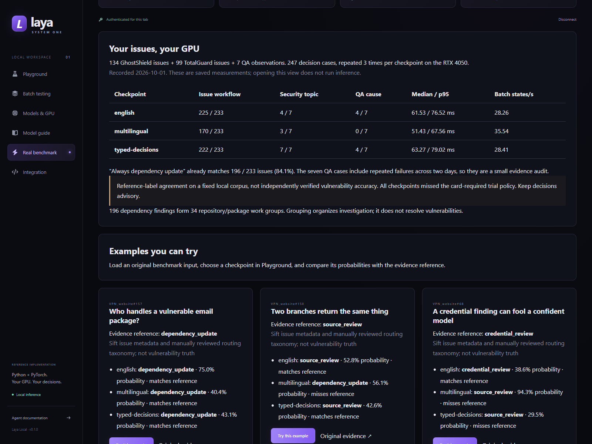
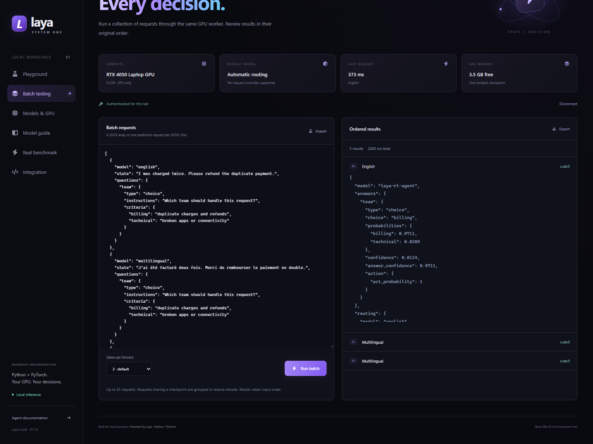
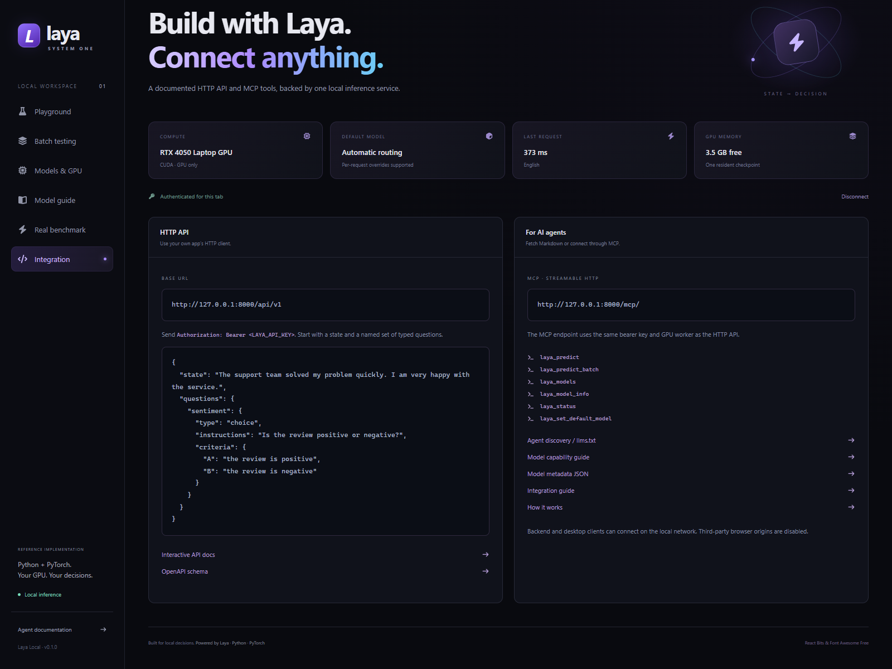
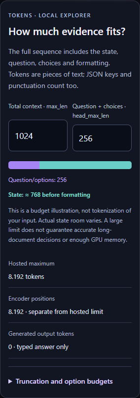

# Live portal screenshots

Captured **October 7, 2026** from the locally running production portal using headless Microsoft Edge. Desktop viewport: 1,600 × 1,200; mobile viewport: 390 × 844. The mobile image captures the token-budget card within that viewport. Reduced motion is enabled.

The Playground and Batch images show real service responses on `cuda:0`, with no API fixtures. Displayed timings belong to these individual requests and can include checkpoint loading. The **Real benchmark** screen displays the frozen October 1 study, not a new October 7 benchmark. Request timings and GPU allocations can differ on another run.

The connection key is not visible or saved in these artifacts. Explicit request overrides preserve the service's saved `auto` default. [Manifest](manifest.json) records the capture timestamp, captions, device, checkpoint revision and SHA-256 hashes. To reproduce: [screenshot instructions](../development.md#refresh-portal-screenshots).

## Playground

Understandable support-ticket input, editable typed questions, probabilities and actual CUDA output.

## Models and GPU

Saved default, current checkpoint, GPU allocation and model controls. Switching checkpoints incurs loading time.

## Model guide

Per-checkpoint capabilities, measured guidance, limits, confidence caveats and an interactive token-budget illustration.

## Real benchmark

Frozen reference matches, timings and replayable real issue/QA examples. These are local study results, not production accuracy guarantees.

## Batch testing

Ordered English, French and Arabic example requests with real results. Export controls keep data under the user's control.

## Integration

REST/MCP discovery, authentication and fetchable documentation links for applications and agents.

## Mobile token budgets

Multilingual context illustration at the default 1,024 total / 256 question tokens, with the hosted 8,192-token ceiling distinguished from the default.

