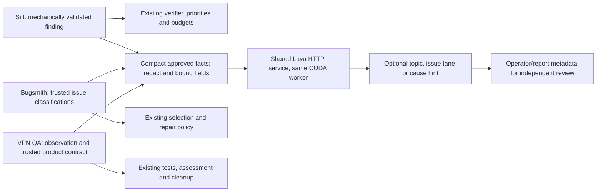

# Local System One integrations

These integrations share the existing authenticated Laya HTTP service. They create no model process in Sift, Bugsmith or QA. Their outputs describe investigation work and never authorize an action.

## Where the advice fits



The arrows to existing policies show the authoritative paths. Laya's branch records advisory metadata only: it does not modify Sift's verifier, Bugsmith's repair selection, or QA's test/notification decisions. Timeout or invalid advice leaves the original workflow running. The [four descriptive illustrations](diagrams/README.md) and [presentation](presentation/v1/README.md) cover these integrations in more detail.

## Fixed advisory endpoints

`POST /api/v1/workflows/{workflow}` accepts `state`, optional `model`, and optional `min_confidence` (default 0.8). Supported workflows:

| Workflow | Output labels | Intended use |
|---|---|---|
| `issue_lane` | dependency_update, credential_review, source_review, business_report | Unstructured issue routing after reliable scanner metadata |
| `security_specialist` | authentication-session, crypto-secret-handling, code-correctness, other | Topic hints for independent investigation |
| `qa_cause` | PRODUCT_BUG, TEST_BUG, INFRA, UNKNOWN | Shadow QA cross-check against an explicit trusted product contract |

The response preserves normal `answers`, `routing`, `usage` and `runtime`, and adds `advice`: workflow, readable label, answer_confidence, review_required, advisory_only=true, authorization=false. The questions are versioned in `laya_portal/workflows.py`, with fixed 512/192 token budgets. Empty evidence is rejected before inference. Authentication, bounded queue, serialization, errors and GPU-only policy are the same as `/predict`.

```python
# Run from any directory; imports/key resolve relative to this example file.
# For the complete runnable client use examples/real_workflows.py.
from pathlib import Path
from dotenv import dotenv_values
import httpx

root = Path(__file__).resolve().parents[1]  # when saved under Laya/examples/
key = dotenv_values(root / '.env')['LAYA_API_KEY']
response = httpx.post('http://127.0.0.1:8000/api/v1/workflows/qa_cause',
    headers={'Authorization': f'Bearer {key}'}, timeout=180,
    json={'model': 'english', 'state': {
        'trusted_contract': 'Trial activation requires a card; verification alone grants no entitlement.',
        'observed_error': 'Old test expected automatic trial; received paywall.'}})
response.raise_for_status()
print(response.json()['advice'])  # A plausible answer can still be wrong.
```

`GET /api/v1/benchmark` requires the same key and returns aggregate measurements plus five replayable real inputs. It performs no GPU work. `/openapi.json` remains the generic machine-readable contract. MCP clients can call existing `laya_predict` with the fixed questions; this change does not add MCP tools or a second worker.

## Optional native adapters

| Repository | Variables | Default checkpoint | Recorded effect |
|---|---|---|---|
| Sift Python reviewer | REVIEWER_LAYA_URL, REVIEWER_LAYA_API_KEY | typed-decisions | `system_one_hint` progress events after mechanical evidence validation |
| vpn-bugsmith | FIXER_LAYA_URL, FIXER_LAYA_API_KEY | english | `TriageResult.system_one_advice` and operator console output |
| VPN QA | QA_LAYA_URL, QA_LAYA_API_KEY | english | Optional `RunReport.systemOneAdvice` in report.json |

Both URL and key must be set in the trusted service process to enable an adapter. Optional `<PREFIX>_MODEL` accepts auto/english/multilingual/typed-decisions. `<PREFIX>_TIMEOUT_SECONDS` defaults to 2 and must be greater than zero and at most 5. Never place keys in source, prompts or coding-agent environments. Sibling adapters do not automatically read Laya's `.env`; configure their service environments explicitly. The replay client reads the key relative to its own file and passes it only to trusted native clients for that invocation.

```powershell
# Example trusted service environment; placeholder key only.
$env:REVIEWER_LAYA_URL = 'http://127.0.0.1:8000'
$env:REVIEWER_LAYA_API_KEY = '<LAYA_API_KEY>'
$env:REVIEWER_LAYA_MODEL = 'typed-decisions'
$env:REVIEWER_LAYA_TIMEOUT_SECONDS = '5'
```

Use a reachable LAN address for a remote process. Container localhost refers to the container, so use a configured host/LAN address instead. This Windows host must be running, and the existing local-subnet firewall rule must allow the connection. No production deployment or firewall change is part of this integration work.

Clients strip common credential forms, account emails, ANSI escapes and long opaque values, then limit each field to 550 characters. They exclude raw screenshots, source evidence quotes, full reports and existing QA classification labels. Redaction is a best-effort projection, not a guarantee for arbitrary confidential content: supply only approved compact facts. Redirects are rejected. Invalid advice, CPU responses, loading/HTTP/timeout failures return no hint. Each stage/run limits shadow calls to eight and stops after an unavailable response. Sift persists only a small typed metadata event, never source excerpts, prompts or raw responses.

Sift keeps its candidate, verifier prompt, attack class, priorities, suppressions and budgets. Bugsmith fixes its selected/deferred/skipped lists using existing classifications, confidence and repair budget before recording hints. QA keeps Playwright status, assessment, cleanup and notification decisions. No adapter turns a classifier label into a tool permission.

## Replay and backlog planning

From Laya:

```powershell
.\.venv\Scripts\python.exe examples\real_workflows.py
.\.venv\Scripts\python.exe examples\real_workflows.py --model typed-decisions --all
.\.venv\Scripts\python.exe examples\plan_real_backlog.py
.\.venv\Scripts\python.exe examples\replay_shadow_adapters.py
```

The first client asks which checkpoint and which real example to use. The backlog planner uses audited metadata to organize the frozen inventory; it does not perform updates or mutate GitHub. Native replay requires the sibling checkouts at `../Agentic-production`, QA's locked Node dependencies, and the captured report snapshots under ignored `data/benchmark/sources`. It exercises the actual installed clients and writes `docs/benchmark/integration-replay.json`. No browser sessions, repair agents, account operations or notifications run.

Warm an explicit checkpoint through `/predict` before short-timeout clients are enabled. A first request after a service restart took 28.86 seconds in a separate replay, so a two-second adapter must fall back during initialization. Mixing checkpoint requests can also cause repeated model loads. Batch related decisions on the same checkpoint; observe queue saturation and use the documented busy retry policy.

## Evidence before automation

The real benchmark favors English for general issue-workflow hints and typed-decisions for the seven topic cases. It does not justify an automated QA gate: every checkpoint misread the intentional card-required trial change. All QA predictions were below the illustrative 0.8 review threshold. That threshold is neither domain calibration nor permission to automate above it.

See [the benchmark report](benchmark/REPORT.md), [raw measurements](benchmark/results.json), [audited corpus](benchmark/corpus.json), and [backlog plan](benchmark/backlog-plan.json). These local/private research artifacts contain repository finding metadata; keep them with the authorized project. Existing prompt-injection and alignment examples remain synthetic demonstrations under `examples/`, not evaluated production defenses.
